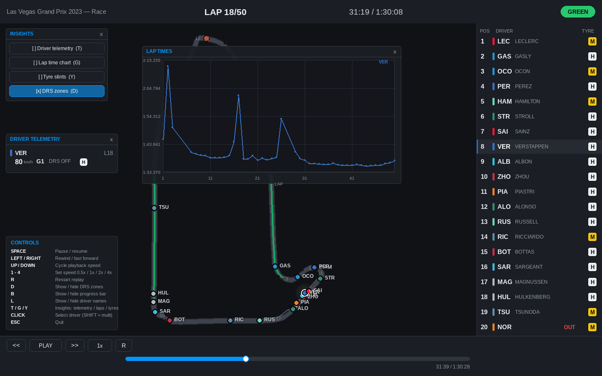

# F1 Replay

> Animated Formula 1 race replay from real telemetry — a live track map with
> Safety Car simulation, leaderboard, tyre strategy and lap-time insights,
> built in Python with Pygame.



## Features

- **Animated track map** — every car's real GPS position from FastF1, drawn on
  the reference racing line with team colours, driver codes, corner numbers,
  pit lane and DRS zone overlays
- **Safety Car simulation** — real track-status data drives a three-phase SC
  (pit-lane deploy → circulate ahead of the leader → return), plus VSC,
  yellow and red-flag status indicators
- **Live leaderboard** — positions from race distance, official classification
  after the chequered flag, tyre compound badges and `OUT` markers for
  retirements (retired cars are crossed out on track)
- **Insight panels** — driver telemetry (speed / gear / DRS / compound),
  lap-time chart, tyre stint history; all draggable and closeable
- **Full playback controls** — pause, seek, scrub, 0.5×–4× speeds, restart,
  toggles for names / DRS / progress bar, click or shift-click to follow
  drivers
- **Session cache** — sessions download once from FastF1, then load in ~1 s

## Quick start

```bash
git clone https://github.com/siddhid1/FormulaMinusOne.git
cd FormulaMinusOne
python -m venv .venv && source .venv/bin/activate
pip install -r requirements.txt
python main.py                    # 2023 Las Vegas GP race
```

## Requirements

- **Python 3.10+** (tested on 3.14)
- [`fastf1`](https://docs.fastf1.live/) — telemetry data
- [`pygame-ce`](https://pyga.me/) — the `pygame` import; chosen over stock
  `pygame` because it ships wheels for the newest Python versions
- `numpy`, `pandas`, `scipy`

## Installation

```bash
# 1. clone + enter
git clone https://github.com/siddhid1/FormulaMinusOne.git
cd FormulaMinusOne

# 2. isolate (recommended)
python -m venv .venv
source .venv/bin/activate        # Windows: .venv\Scripts\activate

# 3. install dependencies
pip install -r requirements.txt

# 4. verify (renders sample frames headlessly, no window needed)
python main.py --smoke-test /tmp/f1-smoke
```

Then launch the default race with `python main.py`. The first run downloads
the session (~30–60 s) and caches it; afterwards it opens instantly.

## Choosing a race

```bash
# list every event of a season (valid --gp names, sessions, dates)
python main.py --list-gps 2024

# launch a specific race / session
python main.py --year 2024 --gp "Monaco Grand Prix" --session R
python main.py --year 2023 --gp "São Paulo Grand Prix" --session Q
python main.py --year 2024 --gp "Chinese Grand Prix"  --session S   # sprint
```

| Flag | Meaning | Default |
| --- | --- | --- |
| `--year` | season year | `2023` |
| `--gp` | event name from `--list-gps` (quote multi-word names) | `Las Vegas` |
| `--session` | `R` race · `Q` qualifying · `S` sprint · `SQ` sprint shootout · `FP1`–`FP3` | `R` |
| `--fullscreen` | start in fullscreen | off |
| `--rebuild` | rebuild preprocessed data from the raw cache | off |
| `--list-gps [YEAR]` | print a season's events and exit | — |
| `--list-cache` | show cached sessions and sizes | — |
| `--clear-cache` | delete **all** cached data | — |
| `--smoke-test [DIR]` | render sample frames headlessly and exit | — |

## Controls

### Keyboard

| Key | Action |
| --- | --- |
| `SPACE` | Pause / resume |
| `←` / `→` | Rewind / forward 5 s — **hold** to scrub at 45× |
| `↑` / `↓` | Cycle speed: 0.5× – 1× – 2× – 4× |
| `1`–`4` | Set speed directly |
| `R` | Restart replay |
| `D` | Show / hide DRS zones |
| `B` | Show / hide progress bar |
| `L` | Show / hide driver names |
| `T` / `G` / `Y` | Insights: telemetry / lap chart / tyre stints |
| `ESC` | Quit |

### Mouse

| Action | Effect |
| --- | --- |
| Click driver (track or leaderboard) | Select / follow |
| `SHIFT`-click | Add to selection |
| Click progress bar / drag | Scrub (amber spans = Safety Car windows) |
| Transport buttons | Rewind · play/pause · forward · speed · restart |
| Drag panel title bar | Move an insight panel |
| Panel `x` | Close it (reopen with `T`/`G`/`Y` or the Insights menu) |
| Click empty track area | Clear selection |

## Data & cache

Race data is stored locally under `cache/` (never committed):

| Path | Content |
| --- | --- |
| `cache/fastf1/` | raw FastF1 downloads (HTTP + session files) |
| `cache/preprocessed/*.pkl` | one preprocessed replay pickle per session |

```bash
python main.py --list-cache                      # what's stored + sizes
python main.py --clear-cache 2023_las_vegas_R    # delete one session
python main.py --clear-cache                     # wipe everything
python main.py --rebuild --year 2023 --gp "Las Vegas" --session R
```

Everything is re-downloadable — safe to delete at any time.

## How it works

```
main.py                  CLI: session selection, cache management, smoke test
src/f1replay/
  loader.py              FastF1 download + raw cache management
  preprocess.py          ReplayDataset builder: track projection, race progress,
                         DRS zones, pit lane, stints, retirements
  models.py              TrackData / DriverData / ReplayDataset dataclasses
  playback.py            playback clock + per-frame sampling
  safety_car.py          SC deploy / lead / return simulation
  track_render.py        world→screen transform, track layer, cars, SC
  hud.py                 top bar, leaderboard, transport, progress, legend
  panels.py              floating insight panels (draggable)
  theme.py               palette, fonts, drawing helpers, glow
  app.py                 event loop, input handling, draw orchestration
tests/
  test_controls.py       headless input & crash-regression suite
```

Key data notes:

- Position + telemetry come from FastF1's merged car channels; the track
  outline is the fastest lap's position data.
- Each sample is projected to *(distance along track, lateral offset)* with a
  KD-tree against the reference polyline.
- Ranking uses integrated race progress with fold-back at the lap seam —
  robust to pit-lane crossings, unlike naive lap counting.
- DRS zones are detected from `DRS ≥ 8` clusters along the track (Las Vegas
  2023: two zones on the long straights).
- Retirements = last movement of a non-classified driver; after the
  chequered flag the official classification takes over.

## Testing

```bash
python tests/test_controls.py     # headless input suite (no display needed)
python main.py --smoke-test out/  # render start/SC/mid/finish frames as PNGs
```

The input suite runs against the cached default session with SDL's dummy
video driver and covers every keyboard/mouse path plus the crash
regressions found on a real display.

## Credits

- [FastF1](https://docs.fastf1.live/) — telemetry & timing data
- [pygame-ce](https://pyga.me/) — rendering & input

This is an unofficial, personal/educational project and is not affiliated
with Formula 1, the FIA, or any team. F1 data is accessed through the
public FastF1 API; respect Formula 1's terms of use.

## Contributing

Issues and pull requests are welcome — especially new session types,
circuits, or visualisations. Please run `python tests/test_controls.py`
before submitting.

## License

[MIT](LICENSE)
